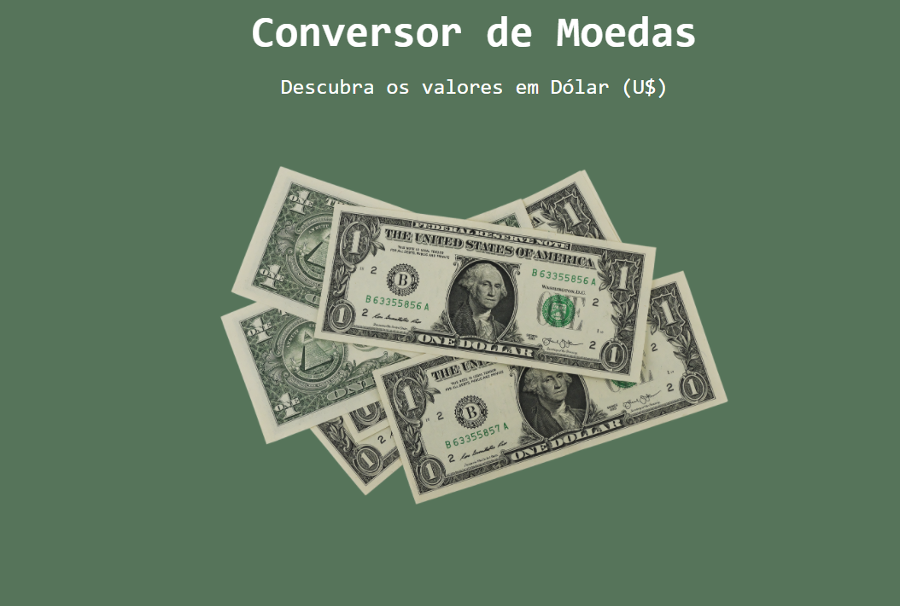

# Conversor de Moeda 💵

Conversor simples de Dólar para Real, em HTML, CSS e JS.

Feito durante curso Imersão Dev (Alura).

Link para o site: https://gabimesquita.github.io/Conversor_de_Moeda/

 

<h2>Como usar?</h2>

1.Após carregar a tela da página, uma caixa de diálogo irá aparecer.

2.Nela, digite o valor em Dólar (U$) utilizando ponto no lugar de vírgula para separar as casas decimais (ex.: 399.99).

3.Clique em OK.

 

4.A janela irá te retornar o valor convertido em Real (R$).

<h2>Licença</h2>

MIT (Massachusetts Institute of Technology)

